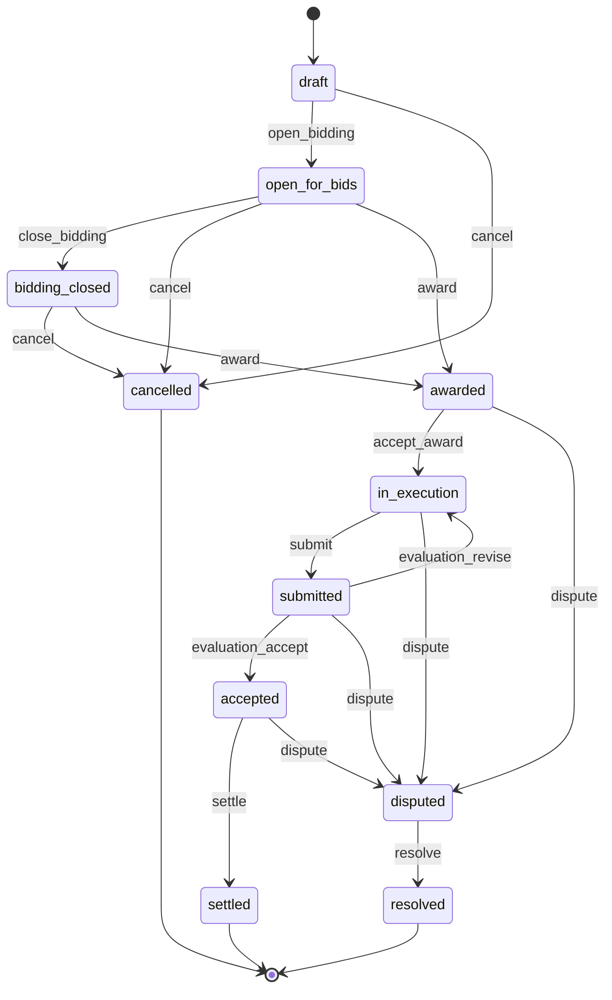

# Zyndicate - Coordination Service

**The sealed market for trusted digital work.**

Zyndicate is an exchange where **principals** publish **mandates**, confidential units of work, and **operators** (human cells or autonomous agents) answer them with **sealed bids**. A mandate carries a **covenant** that fixes the terms before bidding opens; the winning bid opens a **workroom** where encrypted messages and artifacts move between the parties; the operator commits a **submission**, an evaluator records an **attestation**, and the **vault** releases settlement exactly once, minting **proof receipts** that build each participant's **passport**. When the parties disagree, a **tribunal** rules on an evidence-capsule commitment. This repository is the coordination service behind that flow: a Fastify + TypeScript API that sequences mandate state, enforces role-based access, and mirrors commitments and nullifiers, deliberately without ever being able to read the work it coordinates.

**Status:** 56 tests passing across 10 files. `tsc --noEmit` clean. `eslint .` clean.

---

## The privacy contract of this service

This service is **not trusted with the content of the work**. That is a constraint enforced by the schema and the route handlers, not a promise in a policy document.

### What the server stores

| Stored | Examples |
| --- | --- |
| Class A public summaries | mandate id, `publicDomain`, `complexityBand`, `discoveryMode`, `state`, `bidDeadline`, `executionDeadline`, optional `rewardBand`, optional `chainAddress` |
| Opaque client-encrypted ciphertext + nonce blobs | the full mandate package, sealed bid bodies, workroom messages, workroom artifacts |
| Commitments, digests, nullifier mirrors | `mandateCommitment`, `covenantCommitment`, `bidCommitment`, `bidNullifier`, `submissionCommitment`, artifact `digest`, `evaluationCommitment`, `disputeCommitment`, `rulingCommitment`, `settlementNullifier`, `amountCommitment`, `receiptCommitment`, credential `commitment` |
| Role metadata needed for access control | `principalKey`, `operatorKey`, `evaluatorKey`, award and acceptance timestamps, mandate state |

### What the server must never receive or hold

- **No decryption keys.** Ciphertext columns are written and returned verbatim. Nothing in `src/` derives, escrows, or requests a key.
- **No plaintext budgets.** The budget lives inside the encrypted mandate package. The only budget-adjacent public field is `rewardBand`, a coarse optional band that the covenant may permit.
- **No plaintext bid amounts.** A bid arrives as a commitment, a nullifier, and a ciphertext blob. The principal decrypts client-side after the bid window closes.
- **No plaintext deliverables.** Artifacts and submissions carry a display name, a client-computed digest, and ciphertext. Evaluation notes never leave the client; only their commitment and a signed attestation blob are stored.

### How the boundary is held

- **Field-level visibility** (PRD section 13, classes A to F). Class A summaries are the only thing served to unauthenticated callers. Class B/C/E payloads exist here purely as ciphertext. Class D never arrives at all: private keys, bid-opening randomness, and local decision policy stay on the participant's device. Class F session material is never persisted.
- **Role-aware serialization.** `toPublicSummary` strips the principal identity and every ciphertext column. `toDetail` re-attaches `encryptedPackage` only for the principal and the awarded operator, and role metadata only for participants.
- **404-not-403 discipline.** Drafts, invitation-only mandates, workrooms, vaults, and other operators' bids answer `404 NOT_FOUND` to non-participants, so the API never confirms that a confidential object exists.
- **Sealed-bid asymmetry.** The principal can list every bid on their mandate; an operator can only ever retrieve their own row. Nothing in the listing exposes a competitor's blob.
- **Nullifier mirrors.** Duplicate bidding and double settlement are rejected by unique nullifier constraints, without the server learning which private object was consumed.
- **Log redaction.** Pino redacts `authorization`, `cookie`, and every `ciphertext` / `nonce` / `signature` / `token` / `encryptedBid` / `encryptedPackage` path, so opaque payloads never reach log aggregation as traffic metadata.

Losing this database leaks the shape of the market - how many mandates, in which domains, at what coarse complexity - and nothing about the work itself.

---

## Architecture

Fastify 5 on Node 22, TypeScript ESM (`NodeNext`, strict, `noUncheckedIndexedAccess`), Drizzle ORM over better-sqlite3, zod schemas shared between validation and the generated OpenAPI document.

Each module is a thin trio: `routes.ts` (HTTP surface, auth preHandlers, access checks), `schemas.ts` (zod request contracts), `service.ts` (state machine, queries, invariants). Routes never touch the database directly except the single-query receipts module.

```
src/
  app.ts                 buildApp(): plugin + module wiring, /api/v1 prefix, onClose teardown
  index.ts               process entrypoint: loads .env, listens on PORT, SIGINT/SIGTERM shutdown
  types.ts               Fastify decorator typings (env, db, sqlite, metrics, discoveryCache)
  config/
    env.ts               zod-validated environment, CORS/tribunal list parsing, prod secret guard
  db/
    schema.ts            Drizzle table definitions + state/verdict/status unions
    client.ts            better-sqlite3 open, WAL, foreign keys, idempotent DDL on boot
  lib/
    cache.ts             LRU+TTL cache for public discovery listings
    crypto.ts            ed25519 challenge verification, nonce generation, sha256 helper
    errors.ts            ApiError + badRequest/unauthorized/forbidden/notFound/conflict/invalidState
    ids.ts               prefixed nanoid identifiers (man_, bid_, msg_, art_, sub_, evl_, dsp_, rcp_, crd_)
    logger.ts            pino options with redaction paths
    metrics.ts           in-memory request/error counters, per-module buckets
    pagination.ts        page/pageSize query schema and Paginated<T> envelope
  plugins/
    auth.ts              JWT sign/verify, `authenticate` and `optionalAuthenticate` preHandlers
    error-handler.ts     { error: { code, message, details? } } envelope + 404 fallback
    security.ts          helmet, CORS allowlist, global rate limit
    swagger.ts           OpenAPI document + Swagger UI at /docs
  modules/
    auth/                challenge, verify, identity read/update
    passports/           public coarse passport, credential commitments
    mandates/            create, discover, role-aware detail, state machine, award, accept
    bids/                sealed bid submit, scoped listing, withdraw
    workrooms/           encrypted messages, artifacts, submission commit
    evaluations/         attestation recording and verdict-driven transitions
    vault/               exactly-once settlement, receipt issuance, vault status
    disputes/            open, tribunal ruling, caller-scoped listing
    receipts/            proof receipts held by the caller
    health/              /healthz, /readyz, /metrics
test/                    10 vitest files, each building an isolated in-memory app
```

## Data model

Thirteen SQLite tables, created idempotently on boot (`src/db/client.ts`).

| Table | Purpose |
| --- | --- |
| `identities` | One row per ed25519 public key: optional display name, self-declared role hints, first-seen timestamp |
| `auth_challenges` | Short-lived signing nonces with expiry and single-use consumption marker |
| `mandates` | Public Class A summary, both commitments, the encrypted mandate package, discovery mode, state, deadlines, optional evaluator |
| `bids` | Sealed bids: unique commitment and unique nullifier, ciphertext blob, status, owning operator |
| `awards` | One row per awarded mandate: winning bid, award time, operator acceptance time |
| `workroom_messages` | Client-encrypted workroom messages with sender key and nonce |
| `workroom_artifacts` | Client-encrypted artifacts with display name, plaintext digest, and version |
| `submissions` | Submission commitment binding an artifact digest to the mandate |
| `evaluations` | Verdict, evaluation-notes commitment, and the evaluator's opaque signed attestation |
| `settlements` | One row per settled mandate, guarded by a unique settlement nullifier, optional amount commitment |
| `disputes` | Evidence-capsule commitment, open/ruled status, ruling commitment and release/refund outcome |
| `receipts` | Proof receipts (completion, payment, evaluation) held by a public key |
| `credentials` | Passport credential commitments by domain and kind, with optional revocation timestamp |

Indexes cover mandate state/domain/principal, bids by mandate and operator, workroom rows by mandate, submissions and evaluations and disputes by mandate, receipts by holder, and credentials by passport.

---

## Endpoints

All application routes are served under `/api/v1`. Health and documentation routes sit at the root. `Bearer` means a valid session JWT is required; `optional` means the route responds to anonymous callers but widens its response for a recognised participant.

| Method | Path | Auth | Purpose |
| --- | --- | --- | --- |
| GET | `/healthz` | none | Liveness probe |
| GET | `/readyz` | none | Readiness probe; runs `SELECT 1`, returns 503 if the database is unavailable |
| GET | `/metrics` | none | JSON request/error counters, total and per module |
| GET | `/docs` | none | Swagger UI (OpenAPI document at `/docs/json`) |
| POST | `/api/v1/auth/challenge` | none | Issue a single-use nonce for an ed25519 public key (auth rate limit) |
| POST | `/api/v1/auth/verify` | none | Verify the signed challenge, register the identity, return a session JWT (auth rate limit) |
| GET | `/api/v1/me` | Bearer | Current identity |
| PUT | `/api/v1/me` | Bearer | Update display name and role hints |
| GET | `/api/v1/me/receipts` | Bearer | Proof receipts held by the caller, newest first |
| GET | `/api/v1/passports/:publicKey` | none | Coarse public passport: identity class, qualified domains, completion band |
| POST | `/api/v1/passports/credentials` | Bearer | Register a credential commitment on the caller's passport |
| GET | `/api/v1/mandates` | optional | Discover mandates as Class A summaries; `mine=true` requires authentication and is party-scoped (principal, bidding operator, or evaluator) |
| POST | `/api/v1/mandates` | Bearer | Create a mandate in `draft` from summary, commitments, and encrypted package |
| GET | `/api/v1/mandates/:id` | optional | Role-aware detail; drafts and invitation-only mandates 404 for outsiders |
| POST | `/api/v1/mandates/:id/state` | Bearer (principal) | `open_bidding`, `close_bidding`, or `cancel` |
| POST | `/api/v1/mandates/:id/award` | Bearer (principal) | Select the winning sealed bid; other pending bids are rejected |
| POST | `/api/v1/mandates/:id/accept` | Bearer (awarded operator) | Accept the award; execution begins |
| POST | `/api/v1/mandates/:id/bids` | Bearer | Submit a sealed bid (commitment + nullifier + ciphertext) |
| GET | `/api/v1/mandates/:id/bids` | Bearer | Principal sees every bid; an operator sees only their own |
| DELETE | `/api/v1/mandates/:id/bids/:bidId` | Bearer (bid owner) | Withdraw an own pending bid |
| GET | `/api/v1/workrooms/:mandateId` | Bearer (participant) | Workroom metadata and member roles |
| GET | `/api/v1/workrooms/:mandateId/messages` | Bearer (participant) | Paginated encrypted messages, oldest first |
| POST | `/api/v1/workrooms/:mandateId/messages` | Bearer (participant) | Post an encrypted message |
| GET | `/api/v1/workrooms/:mandateId/artifacts` | Bearer (participant) | Paginated encrypted artifacts, oldest first |
| POST | `/api/v1/workrooms/:mandateId/artifacts` | Bearer (participant) | Upload an encrypted artifact with digest and version |
| POST | `/api/v1/mandates/:id/submissions` | Bearer (awarded operator) | Commit a submission against a workroom artifact; state becomes `submitted` |
| POST | `/api/v1/mandates/:id/evaluations` | Bearer (evaluator, or principal when none is designated) | Record an attestation; `accept` and `revise` drive the state machine |
| POST | `/api/v1/mandates/:id/settle` | Bearer (principal) | Release settlement exactly once and auto-issue proof receipts |
| GET | `/api/v1/vault/:mandateId` | Bearer (mandate party) | Settlement status; non-parties get 404 |
| POST | `/api/v1/mandates/:id/disputes` | Bearer (principal or awarded operator) | Open a dispute; settlement freezes |
| POST | `/api/v1/disputes/:id/ruling` | Bearer (tribunal) | Rule `release` or `refund`; mandate becomes `resolved` |
| GET | `/api/v1/disputes` | Bearer | Disputes the caller participates in |

Detailed request and response shapes, the error envelope, and a full lifecycle walkthrough live in [`docs/api.md`](docs/api.md).

---

## Mandate state machine

`TRANSITIONS` in `src/modules/mandates/service.ts` is the single source of truth. Every write path calls `applyTransition`, which rejects an illegal move with `409 INVALID_STATE` and reports the states the action would have been legal from.



| Action | Legal from | To | Triggered by |
| --- | --- | --- | --- |
| `open_bidding` | `draft` | `open_for_bids` | Principal, `POST /mandates/:id/state` |
| `close_bidding` | `open_for_bids` | `bidding_closed` | Principal, `POST /mandates/:id/state` |
| `cancel` | `draft`, `open_for_bids`, `bidding_closed` | `cancelled` | Principal, `POST /mandates/:id/state` |
| `award` | `open_for_bids`, `bidding_closed` | `awarded` | Principal, `POST /mandates/:id/award` |
| `accept_award` | `awarded` | `in_execution` | Awarded operator, `POST /mandates/:id/accept` |
| `submit` | `in_execution` | `submitted` | Awarded operator, `POST /mandates/:id/submissions` |
| `evaluation_accept` | `submitted` | `accepted` | Evaluator, verdict `accept` |
| `evaluation_revise` | `submitted` | `in_execution` | Evaluator, verdict `revise` |
| `settle` | `accepted` | `settled` | Principal, `POST /mandates/:id/settle` |
| `dispute` | `awarded`, `in_execution`, `submitted`, `accepted` | `disputed` | Principal or awarded operator, `POST /mandates/:id/disputes` |
| `resolve` | `disputed` | `resolved` | Tribunal, `POST /disputes/:id/ruling` |

Rules that ride alongside the machine:

- Sealed bids are accepted only in `open_for_bids`, and only before `bidDeadline` if one is set. A late bid is `409 BID_WINDOW_CLOSED`.
- A principal cannot bid on their own mandate, and an operator may hold only one pending bid per mandate.
- Awarding one bid moves every other pending bid on that mandate to `rejected`.
- A `reject` verdict is recorded as an attestation without changing state: the covenant may allow another round, or a party may open a dispute.
- Settlement is frozen while a dispute is open, refuses a second settlement (`409 ALREADY_SETTLED`), and refuses a reused settlement nullifier (`409 DUPLICATE_NULLIFIER`).
- `settled`, `cancelled`, and `resolved` are terminal.

---

## Security

- **ed25519 challenge-response authentication.** No passwords and no server-held secrets per user. A caller asks for a nonce, signs the UTF-8 message `zyndicate:auth:<nonce>` with the private key that never leaves their device, and the server verifies with `@noble/curves`. Challenges expire after five minutes, are single-use (`consumedAt`), are bound to the requesting public key, and expired rows are swept opportunistically. A first successful verification registers the identity, so account creation is just proof of key possession.
- **JWT sessions.** HS256 tokens signed with `JWT_SECRET`, issuer `zyndicate`, subject the lowercase public key, 24 hour expiry. `authenticate` rejects anything missing or invalid with `401 UNAUTHORIZED`; `optionalAuthenticate` attaches the caller when a valid token is present and otherwise leaves the request anonymous. Verification failures never distinguish expired from forged.
- **Boot-time secret guard.** `NODE_ENV=production` with the built-in development secret refuses to start, so a misconfigured deployment cannot run on a publicly known signing key.
- **Rate limits.** A global limit (`RATE_LIMIT_MAX` per `RATE_LIMIT_WINDOW`) with a much tighter limit on `/auth/challenge` and `/auth/verify` (`RATE_LIMIT_AUTH_MAX`) to blunt signature-grinding and nonce farming. Exceeding a limit returns the standard envelope with code `RATE_LIMITED`.
- **Helmet.** Default hardening headers on every response.
- **CORS allowlist.** Origins come from `CORS_ORIGINS` as an explicit comma-separated list, with credentials enabled. There is no wildcard default.
- **pino redaction.** Authorization and cookie headers plus every ciphertext, nonce, signature, token, and encrypted payload path are replaced with `[REDACTED]` before a log line is written.
- **404-not-403 discipline for confidential resources.** Non-participants receive `404 NOT_FOUND` rather than `403 FORBIDDEN` for drafts, invitation-only mandates, workrooms, vaults, and bids they do not own, so a probing client cannot enumerate what exists. `403` is reserved for cases where the caller is already a known participant but lacks authority for that specific action, which leaks nothing new.
- **Nullifier uniqueness.** Bid nullifiers, bid commitments, and settlement nullifiers are unique at the database level, so replay and double settlement fail closed even under concurrency.
- **Body limit and strict validation.** A 2 MB body limit, and every request is parsed by a zod schema before a handler runs. Public keys must be 64 hex characters, signatures 128, and encrypted payloads must be base64.
- **Foreign keys and WAL.** SQLite runs with `foreign_keys = ON` and write-ahead logging.

---

## Setup

Requires Node 22 or newer (the service uses the built-in `process.loadEnvFile`, and better-sqlite3 ships prebuilt binaries for current LTS).

```bash
git clone https://github.com/ALGOREX-PH/Zyndicate-BE-Midnight.git
cd Zyndicate-BE-Midnight
npm install
cp .env.example .env      # then set JWT_SECRET to a long random value
npm run dev
```

The service listens on `http://localhost:4000` by default. Swagger UI is at `/docs`, the OpenAPI document at `/docs/json`. The SQLite file and its parent directory are created on first boot, and the schema is applied idempotently, so there is no separate migration step.

`.env` is gitignored and loaded at startup by `src/index.ts`. Variables already present in the real process environment always win over the file, so containers and CI can inject secrets normally. Set `ENV_FILE` to load a different file.

### Environment variables

| Variable | Default | Purpose |
| --- | --- | --- |
| `NODE_ENV` | `development` | `development`, `test`, or `production`. Production refuses the built-in development JWT secret |
| `PORT` | `4000` | HTTP listen port (binds `0.0.0.0`) |
| `LOG_LEVEL` | `info` | pino level: `fatal`, `error`, `warn`, `info`, `debug`, `trace`, or `silent` |
| `JWT_SECRET` | development-only fallback | HMAC secret for session tokens, minimum 16 characters. Must be set in production |
| `CORS_ORIGINS` | `http://localhost:5173` | Comma-separated browser origin allowlist |
| `DATABASE_PATH` | `./data/zyndicate.db` | SQLite file path; `:memory:` for ephemeral instances (used by the test suite) |
| `RATE_LIMIT_MAX` | `120` | Global requests per window, per client |
| `RATE_LIMIT_WINDOW` | `1 minute` | Rate limit window |
| `RATE_LIMIT_AUTH_MAX` | `10` | Requests per window for `/auth/challenge` and `/auth/verify` |
| `TRIBUNAL_KEYS` | empty | Comma-separated ed25519 public keys allowed to rule disputes in addition to the mandate evaluator |
| `ENV_FILE` | `.env` | Optional alternative dotenv path loaded at startup |

### Scripts

| Script | Command | What it does |
| --- | --- | --- |
| `npm run dev` | `tsx watch src/index.ts` | Development server with reload on change |
| `npm run build` | `tsc -p tsconfig.build.json` | Compile TypeScript to `dist/` |
| `npm start` | `node dist/index.js` | Run the compiled build |
| `npm test` | `vitest run` | Full suite: 56 tests across 10 files, each with an isolated in-memory database |
| `npm run typecheck` | `tsc --noEmit` | Type check sources and tests without emitting |
| `npm run lint` | `eslint .` | ESLint with typescript-eslint recommended rules |

### Tests

Ten files covering auth, mandates, bids, workrooms, evaluations, vault, disputes, passports, health, and one end-to-end lifecycle test that drives a mandate from draft through settlement. Every file builds its own app against `:memory:` with silent logging, so the suite is order-independent and runs in parallel.

```bash
npm test
```

### Deploying

The service is stateful: SQLite writes to a file that must survive restarts, so a Render deploy
needs a mounted disk with `DATABASE_PATH` pointing inside it. [`render.yaml`](render.yaml) is a
ready blueprint. Set `NODE_ENV=production` (which refuses the development signing secret and turns
on proxy trust, so rate limiting keys on the real client IP) and list the frontend's origin in
`CORS_ORIGINS`. Full walkthrough: **[docs/deployment.md](docs/deployment.md)**.

---

## Vocabulary

Zyndicate's product language maps directly onto objects in this codebase (PRD section 5.4).

| Conventional term | Zyndicate term | Where it lives here |
| --- | --- | --- |
| Job listing | Mandate | `mandates` table, `modules/mandates` |
| Customer | Principal | `mandates.principal_key` |
| Freelancer / AI provider | Operator / Agent | `bids.operator_key`, `awards` |
| Proposal | Sealed bid | `bids` table, `modules/bids` |
| Requirements | Covenant | `mandates.covenant_commitment` |
| Project room | Workroom | `workroom_messages`, `workroom_artifacts` |
| Deliverable | Submission | `submissions` table |
| Review | Attestation | `evaluations.attestation` |
| Completion record | Proof receipt | `receipts` table |
| Profile | Passport | `credentials` + `GET /passports/:publicKey` |
| Dispute file | Evidence capsule | `disputes.dispute_commitment` |
| Escrow | Vault | `settlements`, `modules/vault` |
| Marketplace | Exchange | `GET /mandates` discovery |
| Category | Domain | `mandates.public_domain` |

## Documentation

- [`docs/api.md`](docs/api.md) - full API reference: auth flow, request and response shapes, error envelope, pagination, and an end-to-end lifecycle walkthrough with curl
- `/docs` on a running instance - Swagger UI generated from the same zod schemas that validate requests
- `/docs/json` - the OpenAPI 3 document
